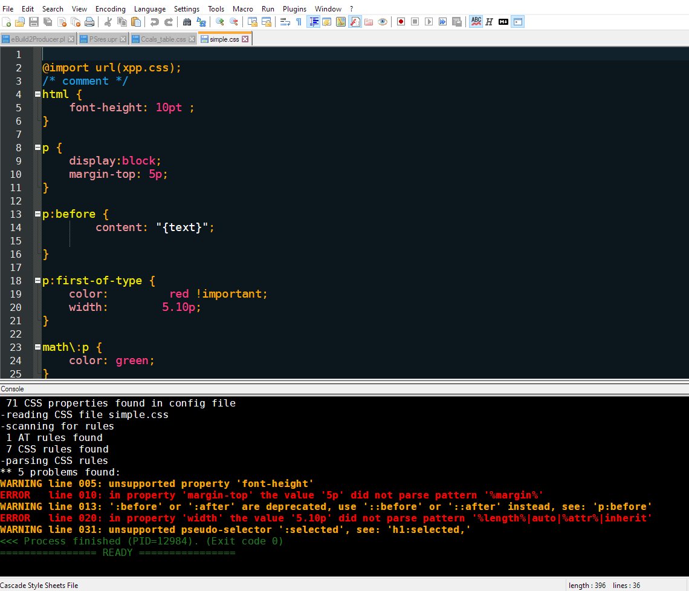
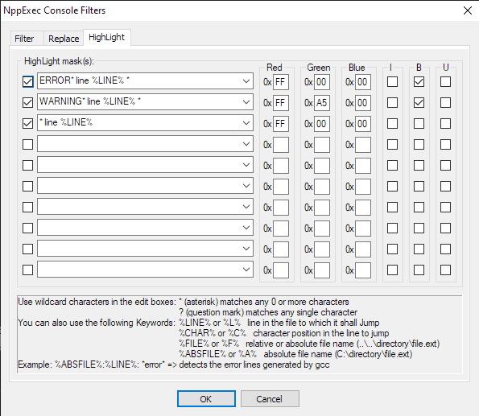

# XPP-CSStool
## What is this?
The **XppCssCheck** allows you to syntax check a CSS file. 

It will check: 
* the overall syntax of the file
* warn if it finds a property that is not supported by XPP
* error if it finds a value that does not match the pattern for this particular value.
* report line numbers where errors or warnings occurred. 

You can run the tool from the command line. In that case the messages are output on the console.

But it works a lot better when you run the tool within an editor like Notepad++.  
The errors/warnings will be output in the notepad++ console window.  
Double clicking on the message will make the cursor jump to the correct line number:  

## Prerequisites
The *XppCssCheck* tool will only run on a system on which XPP is installed.

## Components
The *XPPCssCheck* tool consists of:
* XppCssCheck.pl: the perl program
* XppCssCheck_config.xml: the config file containing the valid properties and the value patterns

The config file gives us an easy way of adopting the XppCssCheck tool to newer XPP revisions should these come with new properties.
The current config file is for __XPP V9.4.0__

## Installation
### XppCssCheck.pl
This program can be installed whereever you want. But it is probably best to install it in the folder: *$XYV_EXECS/procs/util*

### XppCssCheck_config.xml
This file has to be installed in the folder: *$XYV_EXECS/procs/config/XppCssCheck*.  
It is most likely that you have to create both the folder *$XYV_EXECS/procs/config* and *$XYV_EXECS/procs/config/XppCssCheck*

## Notepad++ integration
#### 1. NppExec plugin
Check if the NppExec plugin is installed in your notepad++ instance. To check go to the *Plugins* menu and verify that *NppExec* is one of the menu items.  
You can download *NppExec* from [SourceForge](https://sourceforge.net/projects/npp-plugins/files/NppExec/). Take the latest version. 
Make sure this version works with your version of *notepad++* before installing it (upgrade notepad++ if necessary).  
Follow the installation instructions.

#### 2. configure NppExec
When you have the _NppExec_ installed and working, you need to configure it.  
Go to the menu _Plugins/NppExec_.

First make the console active by checking the '_show console_' item.  
Also activate the '_Console Output Filters..._' item.  
While you are there already fill out the necessary filters. These filter will take care of the color coding of warnings and errors and allow you to double click the problem message and jump to the correct line:   
   
_Note:_ the first line is used on my system for running the perl syntax checker, only filter 2 and 3 are used by the XppCssChecker  

The _Plugins/NppExec_ menu will now look like:  
  

#### 3. configure 'css check' script
Now open the menu item  _Plugins/NppExec/Execute..._  
Copy the following into the Command(s) window:  
  NPP_SAVE
  cd "$(CURRENT_DIRECTORY)"
  cmd /c  %XYV_EXECS%\procs\util\XppCssCheck.pl  "$(FILE_NAME)" 
Press the _Save..._ button and enter a suitable name like _Check CSS_ and press _Save_ again.

Next open the menu item  _Plugins/NppExec/Advanced Options..._   
Click on the field called _Associated Scripts_ and select the _Check CSS_ script.   
Make sure to check the _Place to Macros submenu_ checkbox in the left top corner of the window.   
Hit the _Add/Modify_ button.   
You should get something similar to:   
   
_Note:_ In my case I also have a Check Perl script installed. 

You should now already be able to run the _Check_Css_ macro by opening a CSS file and selecting _Check CSS_ item from the _Macro_ menu.

#### 4. setup hotkey
Optionally you can connect this macro to a hot key.  
Goto the _Settings_ menu and select _Shortcut Mapper..._  
You will find the _Check CSS_ macro in the _Plugin Commands_ tab (around position 63 on my system).  
I selected the _[SHIFT][F2]_ shortcut, but had to remove this shortcut from the _Previous Bookmark_ in the _Main Menu_ tab.  

Et Voila, you are done.

## Limitations
* no support for Paged Media rules (yet)
* tool only checks the current open CSS file. It does not chase down nor check imported stylesheets.

## Authors
tool: Bart Terryn - XP2 - bart@xp2.be  
config file: Tine Philippart - XP2 - tine@xp2.be

## Donations
Donations are welcome through Paypal (paypal.me/BartTerryn)  
If you prefer an invoice, just mail me and I will return you a proper invoice for the amount you want to donate.

